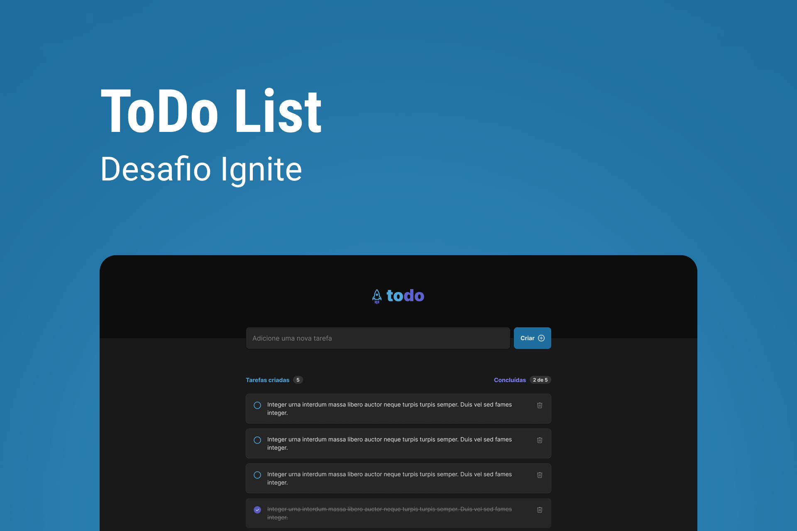

# Desafio Ignite - ToDo-List

Desafio Ignite da [Rocketseat](https://www.youtube.com/c/RocketSeat). Aplicativo para criar lista de tarefas diárias
Aqui veremos os fundamentos:

- Componentes
- Propriedades
- Estado
- Imutabilidade
- React hooks
- Estilização CSS
- Responsividade 

## Requerimentos

- [Node](https://nodejs.org)
- [yarn](https://yarnpkg.com/getting-started/install) ou [npm](https://www.npmjs.com)
- Requerimentos do [React](https://reactjs.org)

## Tech Stack
- HTML
- CSS
- [React](https://reactjs.org)
- [TypeScript](https://www.typescriptlang.org)

